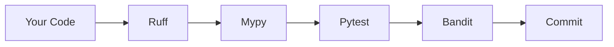

<div align="center">

# AEJAZ SHERIFF QUARAISHI

### Principal AI Architect | Healthcare AI Systems | Production MLOps | Enterprise LLM Deployment

[](https://linkedin.com/in/asheriff)
[](https://pragmaticlogic.ai/)
[](mailto:asq.sheriff@pm.me)


[](https://github.com/asq-sheriff)

**Keywords:** `AI Architect` `Healthcare AI` `Production MLOps` `LLM Deployment` `RAG Systems` `Enterprise Architecture` `HIPAA Compliance` `Therapeutic AI` `Multi-Agent Systems` `AI Governance`

*Atlanta, GA | Open to Principal/Staff AI Architect Opportunities*

</div>

---

## Value Proposition

> **I turn AI demos into production systems that pass regulatory audits, scale to millions, and deliver measurable business outcomes.**

<table>
<tr>
<td width="50%" valign="top">

### Quantifiable Achievements

| Metric | Result |
|--------|--------|
| **Therapeutic Quality Score** | 93.3/100 (40% above CMS 5-Star) |
| **Crisis Detection Recall** | 100% with <5% false positives |
| **System Latency** | <100ms @ 1000+ concurrent users |
| **Production AI Systems** | 28 years enterprise delivery |
| **Healthcare Members Served** | 6M+ at Blue Cross Blue Shield |

</td>
<td width="50%" valign="top">

### Domain Expertise

- **Healthcare AI**: FDA-ready therapeutic systems
- **Enterprise Scale**: Blue Cross (12 yrs), IBM Labs (10 yrs)
- **Compliance**: HIPAA, CMS, FDA, EU AI Act
- **Architecture**: TOGAF 9.1 Certified
- **Current**: Principal Architect @ Pragmatic Logic AI

</td>
</tr>
</table>

---

## Featured Projects

### [Lilo Engine - Therapeutic AI Platform](https://github.com/asq-sheriff/SHOWCASE_REPO-Therapeutic_AI_Companion)
[](https://github.com/asq-sheriff/SHOWCASE_REPO-Therapeutic_AI_Companion)

**Production-Grade Multi-Agent Therapeutic AI | 17 Microservices | 100% Crisis Detection | HIPAA Compliant**


A complete AI system I designed and built from scratch for elderly mental health care:

| Metric | Achievement |
|--------|-------------|
| **Crisis Detection** | 100% recall, <1s response (30x faster than regulatory) |
| **Latency** | ~200ms P50, ~450ms P95 (full request-to-response) |
| **Caching** | 4-layer strategy with 60-70% hit rate |
| **Intent Classification** | 303 prototypes across 10 therapeutic categories |
| **Market Opportunity** | $3T+ TAM, 30,600 US facilities |

**Technical Highlights**:
- 7 therapeutic agents with evidence-based interventions (C-SSRS compliant)
- 5-level risk stratification (Joint Commission compliant)
- RAG pipeline with 6 parallel streams (asyncio.gather ~2x speedup)
- Qwen 2.5-7B on Apple Silicon (Metal GPU, 45-50 tok/s)

[](https://github.com/asq-sheriff/SHOWCASE_REPO-Therapeutic_AI_Companion/blob/main/docs/DEMO_SHOWCASE.md)
[](https://github.com/asq-sheriff/SHOWCASE_REPO-Therapeutic_AI_Companion/blob/main/docs/TECHNICAL_PORTFOLIO.md)
[](https://github.com/asq-sheriff/SHOWCASE_REPO-Therapeutic_AI_Companion/blob/main/docs/CODE_SAMPLES.md)
[](https://github.com/asq-sheriff/SHOWCASE_REPO-Therapeutic_AI_Companion/blob/main/docs/PROCESS_FLOW.md)

[](https://github.com/asq-sheriff/SHOWCASE_REPO-Therapeutic_AI_Companion/blob/main/EXECUTIVE_SUMMARY.md)
[](https://github.com/asq-sheriff/SHOWCASE_REPO-Therapeutic_AI_Companion/blob/main/docs/INVESTOR_OVERVIEW.md)
[](https://github.com/asq-sheriff/SHOWCASE_REPO-Therapeutic_AI_Companion/blob/main/docs/PARTNERSHIP_OPPORTUNITIES.md)
[](https://github.com/asq-sheriff/SHOWCASE_REPO-Therapeutic_AI_Companion/blob/main/FAQ.md)

---

### [AI-Production-Checklist](https://github.com/asq-sheriff/AI-Production-Checklist)
[](https://github.com/asq-sheriff/AI-Production-Checklist)

**The Ultimate Enterprise AI Deployment Guide | 170+ Checklist Items | Architecture Diagrams**


Addressing why **87% of ML projects fail** to reach deployment:

| Metric | Value |
|--------|-------|
| **Checklist Items** | 170+ production-ready checks |
| **Critical Sections** | 14 (Architecture, Security, Red Teaming, FinOps, Governance) |
| **Industry Frameworks** | Gartner AI Roadmap, OWASP LLM Top 10, NIST AI RMF |
| **Interactive Tools** | HTML auto-scoring checklist, CSV template, Mermaid diagrams |

**Why This Matters**: Based on 28 years of enterprise systems delivery and seeing countless AI projects fail at the production stage.

> *"After 28 years of enterprise systems and seeing countless AI projects fail, I compiled everything you need to consider before deploying AI to real users."*

[](https://github.com/asq-sheriff/AI-Production-Checklist/blob/main/ai-production-checklist.html)
[](https://github.com/asq-sheriff/AI-Production-Checklist/blob/main/AI-Production-Checklist-Template.csv)
[](https://github.com/asq-sheriff/AI-Production-Checklist/blob/main/ai-production-architecture.png)
[](https://github.com/asq-sheriff/AI-Production-Checklist/blob/main/CONTRIBUTING.md)
[](https://github.com/asq-sheriff/AI-Production-Checklist/blob/main/SECURITY.md)

---

### [MultiDB_RAG_AI](https://github.com/asq-sheriff/MultiDB_RAG_AI)
[](https://github.com/asq-sheriff/MultiDB_RAG_AI)

**RAG Pipeline | Vector Search | LLM Integration | Multi-Database Architecture**


Production-ready RAG demonstrating polyglot persistence and enterprise patterns:

| Component | Implementation |
|-----------|----------------|
| **RAG Pipeline** | LangChain orchestration with semantic search |
| **Vector Store** | MongoDB Atlas with embedding indexing |
| **Polyglot Persistence** | PostgreSQL (ACID), ScyllaDB (logs), Redis (cache) |
| **LLM Support** | OpenAI GPT + local Qwen fallback |
| **Architecture** | Two-plane design for independent scaling |

**Enterprise Patterns**: JWT/OAuth2 auth, billing service, rate limiting, structured logging, zero-downtime deployments

[](https://github.com/asq-sheriff/MultiDB_RAG_AI/blob/main/docs/SYSTEM_DESIGN.md)
[](https://github.com/asq-sheriff/MultiDB_RAG_AI/blob/main/docs/ARCHITECTURE.md)
[](https://github.com/asq-sheriff/MultiDB_RAG_AI/blob/main/docs/CODEBASE_OVERVIEW.md)
[](https://github.com/asq-sheriff/MultiDB_RAG_AI/blob/main/docs/RAG_FUNDAMENTALS.md)
[](https://github.com/asq-sheriff/MultiDB_RAG_AI/blob/main/docs/ROADMAP.md)

---

### [terraform-aws-multi-az-production](https://github.com/asq-sheriff/terraform-aws-multi-az-production)
[](https://github.com/asq-sheriff/terraform-aws-multi-az-production)

**Production-Grade AWS VPC Module | Multi-AZ | Infrastructure as Code | Enterprise-Ready**


A reusable Terraform module for deploying secure, scalable AWS VPC infrastructure—the foundation for production AI workloads:

| Metric | Value |
|--------|-------|
| **Resources Orchestrated** | 15+ AWS resources |
| **Network Capacity** | 65,000+ IPs (/16 VPC) |
| **Deployment Time** | ~3 minutes |
| **Availability** | Multi-AZ (2-6 zones) |

- **Network Architecture**: Public/private subnet segmentation with NAT Gateway for secure egress
- **Security Features**: VPC Flow Logs, Network ACLs, private-first design pattern
- **Enterprise Patterns**: Consistent tagging, input validation, modular structure
- **CI/CD Pipeline**: GitHub Actions with automated Terraform validation

[](https://github.com/asq-sheriff/terraform-aws-multi-az-production/blob/main/docs/README.md)
[](https://github.com/asq-sheriff/terraform-aws-multi-az-production/blob/main/CHANGELOG.md)
[](https://github.com/asq-sheriff/terraform-aws-multi-az-production/blob/main/CONTRIBUTING.md)
[](https://github.com/asq-sheriff/terraform-aws-multi-az-production/blob/main/LICENSE)

---

### [cookiecutter-modern-python](https://github.com/asq-sheriff/cookiecutter-modern-python)
[](https://github.com/asq-sheriff/cookiecutter-modern-python)

**Production-Ready Python Project Template | Cookiecutter | Modern Tooling | Best Practices**


A zero-config Cookiecutter template that scaffolds production-ready Python projects with modern tooling and automated quality gates:

| Metric | Value |
|--------|-------|
| **Linting Speed** | 10-100x faster (Ruff vs Black+isort+Flake8) |
| **Type Coverage** | 100% with Mypy strict mode |
| **Setup Time** | ~30 seconds to scaffold |
| **Quality Gates** | 5 automated pre-commit hooks |

- **Modern Toolchain**: Ruff (unified linter/formatter), Mypy, Pytest, Bandit security scanning
- **Automated Quality**: Pre-commit hooks for lint, format, type-check, and security on every commit
- **Production Patterns**: Typer CLI scaffolding, Rich terminal UI, conventional commits with Commitizen
- **Rich Documentation**: Mermaid diagrams for architecture, workflow, and toolchain visualization



> *"The foundation I use for all my AI/ML projects—consistent tooling means I can focus on solving problems, not configuring environments."*

[](https://github.com/asq-sheriff/cookiecutter-modern-python#quick-start)
[](https://github.com/asq-sheriff/cookiecutter-modern-python#features)
[](https://github.com/asq-sheriff/cookiecutter-modern-python#tool-stack)
[](https://github.com/asq-sheriff/cookiecutter-modern-python/blob/main/.pre-commit-config.yaml)
[](https://github.com/asq-sheriff/cookiecutter-modern-python/blob/main/LICENSE)

---

## Technical Stack

<div align="center">

**Languages & Frameworks**


**AI/ML & LLM Infrastructure**


**Databases & Storage**


**Infrastructure & DevOps**


</div>

---

## Certifications & Credentials

<table>
<tr>
<td width="50%">

**Completed**
- **TOGAF 9.1** Certified Enterprise Architect
- **HL7 FHIR** Healthcare Interoperability
- **HIPAA** Security Officer
- **ITIL 4** Foundation

</td>
<td width="50%">

**In Progress**
- Google Professional Machine Learning Engineer
- Google Professional Cloud Architect

</td>
</tr>
</table>

---

## GitHub Activity

<div align="center">


</div>

---

## Roadmap

- [x] **Lilo Engine Core** — 17 microservices, 7 therapeutic agents, 100% crisis recall
- [ ] **Safety-Critical Infrastructure** — IEC 61508 compliant safety kernel, formal verification
- [ ] **EHR Integration** — Epic & Cerner via FHIR R4, SMART on FHIR OAuth 2.0
- [ ] **Edge-Cloud Architecture** — K3s + Jetson for <50ms local inference
- [ ] **FDA De Novo Submission** — Clinical validation with 100 residents across 3 facilities
- [ ] **RPM Device Integration** — Vitals monitoring with Medicare billing ($1,560/patient/year)

---

## Current Focus

```python
lilo_engine = {
    "project": "Lilo Engine - Therapeutic AI Platform",
    "phase": "Phase 1: Safety-Critical Infrastructure",
    "status": "Production Ready (Core Platform)",
    "stack": {
        "ai": ["Qwen 2.5-7B", "BGE Embeddings", "Whisper STT", "Piper TTS"],
        "backend": ["Go 1.25", "Python 3.12", "FastAPI", "Gin"],
        "infra": ["Docker", "PostgreSQL + pgvector", "Redis", "Langfuse"]
    },
    "compliance": ["HIPAA §164.312", "FDA 21 CFR Part 11", "ISO 13485"],
    "metrics": {
        "crisis_detection": "100% recall, <1s response",
        "therapeutic_quality": "93.3/100 score",
        "microservices": 17,
        "therapeutic_agents": 7
    },
    "next_milestone": "Safety Kernel + Device Abstraction Layer"
}
```

> _"The difference between a demo and production isn't the AI model—it's the 90% of 'boring' stuff that makes it reliable, secure, and scalable."_

---

<div align="center">

## Let's Connect

**Looking for a Principal/Staff AI Architect who can deliver production AI systems?**

[](https://linkedin.com/in/asheriff)
[](mailto:asq.sheriff@pm.me)
[](https://pragmaticlogic.ai/)

---

*28 years of progressive technical leadership | C-suite vision to hands-on delivery | Enterprise AI at scale*

**[Pragmatic Logic AI](https://pragmaticlogic.ai)**

</div>
